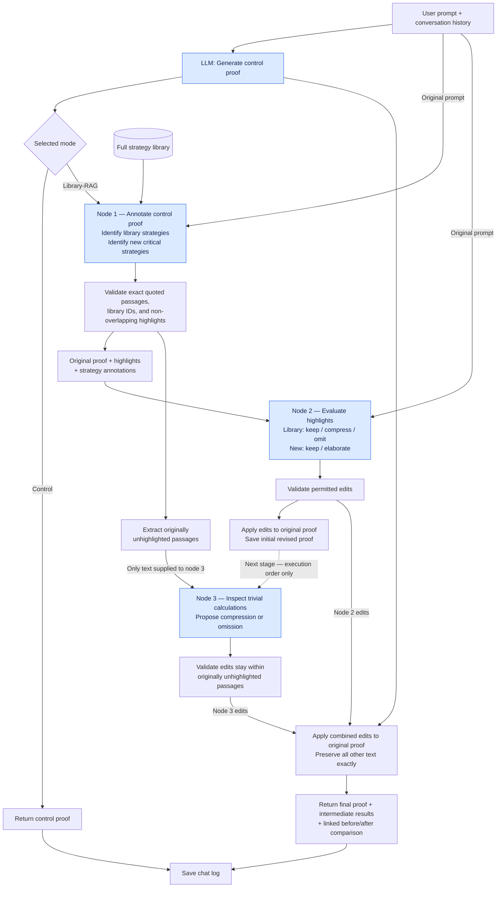

# Main Agent Interface

This is a local two-mode AI interface for the proof-strategy library.

## Run

From project root:

```bash
.venv/bin/python main/agent_server.py
```

Open:

```text
http://127.0.0.1:8877
```

## Modes

### 1. Control group

Direct GPT interaction. The model answers normally and does not have to cite the strategy library.

### 2. Library-RAG

Before answering, the server retrieves relevant nodes from:

```text
data/general/strategy_hierarchy.json
```

The model is instructed to ground proof plans/explanations in these strategies. Every answer should end with:

```text
Referenced strategy nodes / proposed additions
```

There it should list the strategy nodes it used or propose a genuinely new strategy if none of the retrieved/library strategies fit.

## Requirements

- `.env` with `OPENAI_API_KEY=...` for local use, or cloud environment secret `OPENAI_API_KEY`
- `data/general/strategy_hierarchy.json`

If the graph does not exist, run:

```bash
.venv/bin/python workflows/library_hierarchy/build_strategy_hierarchy.py
```

## Basic Auth

Basic Auth is enabled only when both variables are set:

```text
PROOF_AGENT_USERNAME
PROOF_AGENT_PASSWORD
```

For local testing with auth:

```bash
HOST=127.0.0.1 PORT=8877 \
PROOF_AGENT_USERNAME=professor \
PROOF_AGENT_PASSWORD='choose-a-strong-password' \
.venv/bin/python main/agent_server.py
```

For Hugging Face Spaces, set those as Space secrets.

## Hugging Face Docker Space

The repo root now includes:

```text
Dockerfile
requirements.txt
.dockerignore
```

The Docker image copies only:

```text
main/
data/general/strategy_hierarchy.json
```

It does **not** copy `.env`, external ATLAS data, PDFs, processed dataset backups, or the virtual environment.

Hugging Face Space secrets to set:

```text
OPENAI_API_KEY
PROOF_AGENT_USERNAME
PROOF_AGENT_PASSWORD
```

HF Docker Spaces use port `7860`; the Dockerfile sets:

```text
HOST=0.0.0.0
PORT=7860
```

## Files

```text
main/agent_server.py
main/index.html
```

## Current processing flow

The diagram below reflects the current three-node pipeline in `agent_server.py`.
Blue boxes are LLM calls; the other steps run in Python. This flow supersedes the
older Library-RAG description above: node 1 receives the full strategy library
from `data/train/general/strategy_hierarchy.json`.



Node 3 does not receive the initial revised proof. It runs afterward but sees only
the originally unhighlighted passages. Python combines both nodes' edits against
the original control proof.

Invalid edits stop the pipeline with an error. Validation enforces editing
boundaries; it does not formally verify mathematical correctness.
